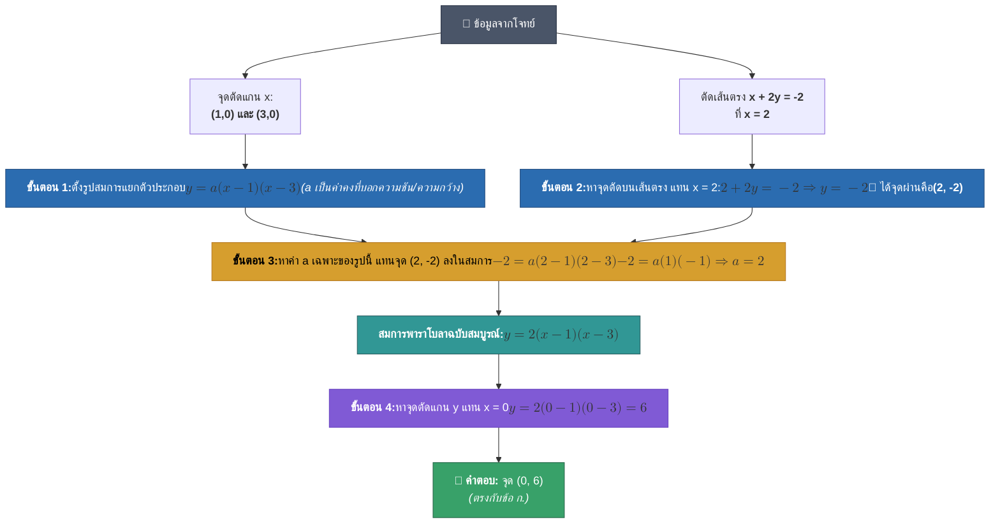

# โจทย์ข้อที่ 19: พาราโบลาและจุดตัดแกน $y$

## 📝 โจทย์
> **กำหนด พาราโบลาหงายรูปหนึ่งมีจุดตัดแกน $x$ ที่ $(1,0)$ และ $(3,0)$ และตัดกับเส้นตรง $x+2y=-2$ ที่ $x=2$ จงหาจุดตัดแกน $y$ ของพาราโบลารูปนี้**
> 
> - **ก.** $(0,6)$
> - **ข.** $(0,4)$
> - **ค.** $(0,3)$
> - **ง.** $(0,2)$

---

## 📈 รูปกราฟพาราโบลาและเส้นตรง (Visual Plot)

![[parabola_graph.svg]]

> 🔍 **สังเกตจากกราฟ:**
> - เส้นโค้งสีฟ้าคือพาราโบลา $y = 2x^2 - 8x + 6$ ตัดแกน $x$ ที่จุด **$(1,0)$** และ **$(3,0)$**
> - เส้นประสีส้มคือเส้นตรง $x + 2y = -2$ ตัดกับพาราโบลาพอดีที่จุดยอด **$(2, -2)$**
> - กราฟพุ่งขึ้นไปตัดแกน $y$ (จุดสีเขียว ★) ที่จุด **$(0, 6)$** ซึ่งเป็นคำตอบของโจทย์

---

## 🔍 ที่มาของค่า $a$ คืออะไร และมาจากไหน?

ในสมการพาราโบลา รูปแบบทั่วไปคือ $y = ax^2 + bx + c$ 

ค่า **$a$ (Leading Coefficient)** คือ **"ตัวคูณกำหนดความกว้าง-แคบ และทิศทางคว่ำ/หงายของกราฟ"**

### 1. ที่มาตามสูตรแยกตัวประกอบ (Factored Form)
เมื่อเราทราบว่ากราฟตัดแกน $x$ ที่ $x = p$ และ $x = q$ (หมายถึงเมื่อ $y = 0$ จะได้ $x = p, q$)
ตามหลักพีชคณิต พหุนามที่มีรากคือ $p$ และ $q$ จะเขียนได้ในรูป:
$$y = a(x - p)(x - q)$$
ในโจทย์ข้อนี้ จุดตัดแกน $x$ คือ $(1, 0)$ และ $(3, 0)$ จึงแทน $p=1, q=3$ จะได้:
$$y = a(x - 1)(x - 3)$$

> 💡 **ทำไมต้องติดค่า $a$ ไว้?**
> เพราะว่ามีพาราโบลาหงายได้ **นับล้านๆ รูปแบบ** ที่ตัดแกน $x$ ที่จุด $(1,0)$ และ $(3,0)$ เดียวกันนี้ เช่น:
> - ถ้า $a = 1 \Rightarrow y = 1(x-1)(x-3)$ (ความกว้างปกติ)
> - ถ้า $a = 2 \Rightarrow y = 2(x-1)(x-3)$ (กราฟจะแคบและชันขึ้น)
> - ถ้า $a = 0.5 \Rightarrow y = 0.5(x-1)(x-3)$ (กราฟจะอ้ากว้างและแบนลง)
> 
> ดังนั้น จุดตัดแกน $x$ เพียงอย่างเดียวยัง **ไม่เพียงพอ** ในการบอกว่ากราฟชันแค่ไหน เราจึงต้องใส่ $a$ ไว้ก่อน แล้วใช้ **จุดอื่นๆ ที่กราฟวิ่งผ่าน** มาคำนวณหาค่า $a$ ที่แท้จริง

---

## 🗺️ แผนผังขั้นตอนการแก้โจทย์ (Mermaid Flowchart)

---

## 💡 แนวคิดและขั้นตอนการแก้โจทย์อย่างละเอียด

### ขั้นตอนที่ 1: ตั้งรูปสมการของพาราโบลาจากจุดตัดแกน $x$
เนื่องจากพาราโบลานี้เป็นพาราโบลาหงาย และมีจุดตัดแกน $x$ อยู่ที่ $(1, 0)$ และ $(3, 0)$ เราสามารถเขียนสมการในรูปแบบแยกตัวประกอบ (Factored Form) ได้ดังนี้:

$$y = a(x - 1)(x - 3)$$

*(โดยที่ $a > 0$ เนื่องจากเป็นพาราโบลาหงาย)*

---

### ขั้นตอนที่ 2: หาจุดตัดระหว่างพาราโบลากับเส้นตรง
โจทย์ระบุว่า พาราโบลาตัดกับเส้นตรง $x + 2y = -2$ ที่ตำแหน่ง $x = 2$

1. นำค่า $x = 2$ ไปแทนในสมการเส้นตรงเพื่อหาค่า $y$:
   $$2 + 2y = -2$$
   $$2y = -2 - 2$$
   $$2y = -4$$
   $$y = -2$$

ดังนั้น **จุดตัดของพาราโบลาและเส้นตรงคือ $(2, -2)$** (หมายความว่าพาราโบลาต้องลากผ่านจุดนี้ด้วย)

---

### ขั้นตอนที่ 3: หาค่าสัมประสิทธิ์ $a$ ของพาราโบลา
นำจุดผ่าน $(x=2, y=-2)$ ไปแทนในสมการ $y = a(x - 1)(x - 3)$ เพื่อปลดล็อคค่า $a$:

$$-2 = a(2 - 1)(2 - 3)$$
$$-2 = a(1)(-1)$$
$$-2 = -a$$
$$a = 2$$

ดังนั้น สมการพาราโบลาฉบับสมบูรณ์คือ:
$$y = 2(x - 1)(x - 3)$$
$$y = 2(x^2 - 4x + 3) = 2x^2 - 8x + 6$$

---

### ขั้นตอนที่ 4: หาจุดตัดแกน $y$ ของพาราโบลา
การหาจุดตัดแกน $y$ ทำได้โดยการกำหนดให้ **$x = 0$** แล้วหาค่า $y$:

$$y = 2(0 - 1)(0 - 3)$$
$$y = 2(-1)(-3)$$
$$y = 6$$

ดังนั้น จุดตัดแกน $y$ ของพาราโบลารูปนี้คือ **$(0, 6)$**

---

## 📊 พิกัดสำคัญบนกราฟ (Graph Points Summary)

| จุดสำคัญ | พิกัด $(x, y)$ | ความหมาย |
| :--- | :---: | :--- |
| **จุดตัดแกน $y$** | $(0, 6)$ | จุดที่กราฟตัดแกนดิ่ง (คำตอบของโจทย์ ★) |
| **จุดตัดแกน $x$ (1)** | $(1, 0)$ | จุดที่กราฟตัดแกนราบจุดแรก |
| **จุดยอด (Vertex)** | $(2, -2)$ | จุดต่ำสุดของพาราโบลา และจุดตัดกับเส้นตรง $x+2y=-2$ |
| **จุดตัดแกน $x$ (2)** | $(3, 0)$ | จุดที่กราฟตัดแกนราบจุดที่สอง |
| **จุดสมมาตร** | $(4, 6)$ | จุดสะท้อนเทียบกับแกนสมมาตร $x=2$ |

---

## ✅ สรุปคำตอบ
ตอบข้อ **ก. $(0,6)$**

