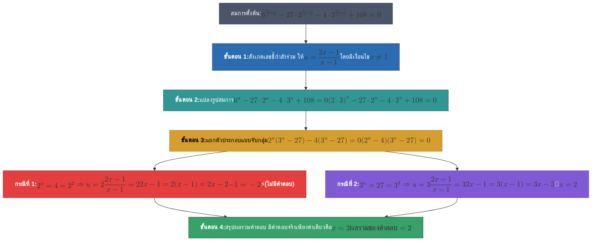

# โจทย์ข้อที่ 22: ผลรวมของคำตอบสมการเอกซ์โพเนนเชียล

## 📝 โจทย์
> **จงหาผลรวมของคำตอบทั้งหมดของสมการ**
> $$6^{\frac{2x-1}{x-1}} - 27 \cdot 2^{\frac{2x-1}{x-1}} - 4 \cdot 3^{\frac{2x-1}{x-1}} + 108 = 0$$
> 
> - **ก.** 2
> - **ข.** 3
> - **ค.** 4
> - **ง.** 5

---

## 🗺️ แผนผังขั้นตอนการแก้โจทย์ (Mermaid Flowchart)

---

## 💡 วิธีทำอย่างละเอียดทีละขั้นตอน

### ขั้นตอนที่ 1: กำหนดตัวแปรช่วยสำหรับเลขชี้กำลัง
สังเกตว่าเลขชี้กำลังของทุกพจน์คือ **$\frac{2x-1}{x-1}$** เหมือนกันทั้งหมด
กำหนดให้:
$$u = \frac{2x-1}{x-1} \quad (\text{โดยที่ } x \neq 1)$$

สมการจะลดรูปลงเหลือ:
$$6^u - 27 \cdot 2^u - 4 \cdot 3^u + 108 = 0$$

---

### ขั้นตอนที่ 2: แยกตัวประกอบ (Factoring by Grouping)
เนื่องจาก $6^u = (2 \cdot 3)^u = 2^u \cdot 3^u$ จะได้:
$$2^u \cdot 3^u - 27 \cdot 2^u - 4 \cdot 3^u + 108 = 0$$

จับคู่ดึงตัวร่วม:
$$2^u(3^u - 27) - 4(3^u - 27) = 0$$
$$(2^u - 4)(3^u - 27) = 0$$

---

### ขั้นตอนที่ 3: หาค่า $u$ และแก้สมการหาค่า $x$

#### **กรณีที่ 1:** $2^u - 4 = 0$
$$2^u = 4 = 2^2 \implies u = 2$$

นำ $u = 2$ ไปแทนกลับใน $u = \frac{2x-1}{x-1}$:
$$\frac{2x-1}{x-1} = 2$$
$$2x - 1 = 2(x - 1)$$
$$2x - 1 = 2x - 2$$
$$-1 = -2 \quad \text{(สมการเป็นเท็จ)}$$

> ⚠️ **สรุปกรณีที่ 1:** **ไม่มีค่า $x$ ที่เป็นคำตอบ**

---

#### **กรณีที่ 2:** $3^u - 27 = 0$
$$3^u = 27 = 3^3 \implies u = 3$$

นำ $u = 3$ ไปแทนกลับใน $u = \frac{2x-1}{x-1}$:
$$\frac{2x-1}{x-1} = 3$$
$$2x - 1 = 3(x - 1)$$
$$2x - 1 = 3x - 3$$
$$3 - 1 = 3x - 2x$$
$$x = 2$$

>  **สรุปกรณีที่ 2:** ได้คำตอบคือ **$x = 2$** (และ $x = 2 \neq 1$ จึงเป็นคำตอบที่ถูกต้อง)

---

### ขั้นตอนที่ 4: สรุปผลรวมของคำตอบทั้งหมด
เนื่องจากคำตอบของสมการมีเพียงค่าเดียวคือ $x = 2$ 
ดังนั้น ผลรวมของคำตอบทั้งหมดจึงเท่ากับ **$2$**

---

## ✅ สรุปคำตอบ
ตอบข้อ **ก. 2**
