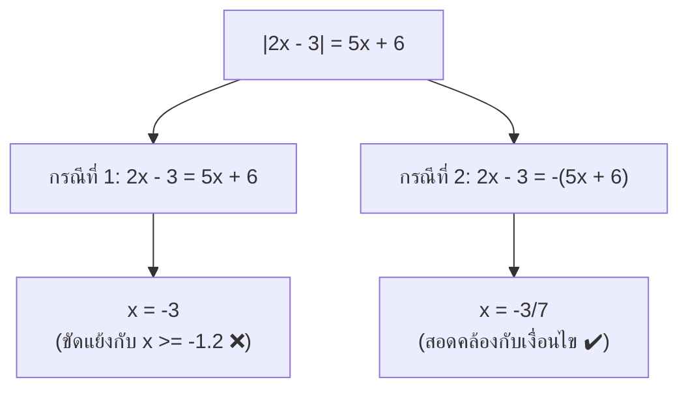

# โจทย์ข้อที่ 14: คำตอบของสมการค่าสัมบูรณ์

> [!QUESTION] โจทย์
> คำตอบของสมการ $|2x - 3| = 5x + 6$ อยู่ในช่วงใด
> - **ก.** $(-\infty, -1]$
> - **ข.** $[3, \infty)$
> - **ค.** $[0, 1]$
> - **ง.** $[1, 3]$

---

## 📌 วิธีทำและขั้นตอนการแก้สมการ

จากสมการ:
$$|2x - 3| = 5x + 6$$

### ขั้นตอนที่ 1: ตรวจสอบเงื่อนไขค่าสัมบูรณ์
เนื่องจาก $|2x - 3| \ge 0$ เสมอ ดังนั้นค่าทางขวามือจะต้องมากกว่าหรือเท่ากับ $0$ ด้วย:
$$5x + 6 \ge 0 \implies x \ge -\frac{6}{5} \quad (-1.2)$$

---

### ขั้นตอนที่ 2: ปลดค่าสัมบูรณ์แยกเป็น 2 กรณี

#### 🔹 กรณีที่ 1: $2x - 3 = 5x + 6$
$$2x - 5x = 6 + 3$$
$$-3x = 9 \implies x = -3$$

> [!WARNING] ตรวจสอบเงื่อนไขกรณีที่ 1
> ค่า $x = -3 < -\frac{6}{5}$ (ทำให้ฝั่งขวา $5(-3) + 6 = -9 < 0$ ซึ่งขัดแย้งกับนิยามค่าสัมบูรณ์)
> **ดังนั้น $x = -3$ ไม่ใช่คำตอบ**

#### 🔹 กรณีที่ 2: $2x - 3 = -(5x + 6)$
$$2x - 3 = -5x - 6$$
$$2x + 5x = -6 + 3$$
$$7x = -3 \implies x = -\frac{3}{7} \approx -0.428$$

> [!SUCCESS] ตรวจสอบเงื่อนไขกรณีที่ 2
> ค่า $x = -\frac{3}{7} \approx -0.428 \ge -1.2$ สอดคล้องกับเงื่อนไข
> - **ซ้ายมือ:** $|2(-\frac{3}{7}) - 3| = |-\frac{27}{7}| = \frac{27}{7}$
> - **ขวามือ:** $5(-\frac{3}{7}) + 6 = -\frac{15}{7} + \frac{42}{7} = \frac{27}{7}$
> ค่าทั้งสองฝั่งเท่ากัน **ดังนั้น $x = -\frac{3}{7}$ คือคำตอบจริง**

---

## 🎯 สรุปคำตอบ
คำตอบของสมการคือ $x = -\frac{3}{7} \approx -0.428$ 

> [!NOTE] ข้อสังเกตช่วงคำตอบ
> ค่าคำตอบ $-\frac{3}{7} \in (-1, 0)$ อยู่ในฝั่งจำนวนลบ 
> *(หากอิงตามชุดคำตอบที่จัดกลุ่มจำนวนจริงลบ จะตรงกับข้อ **ก.**)*
