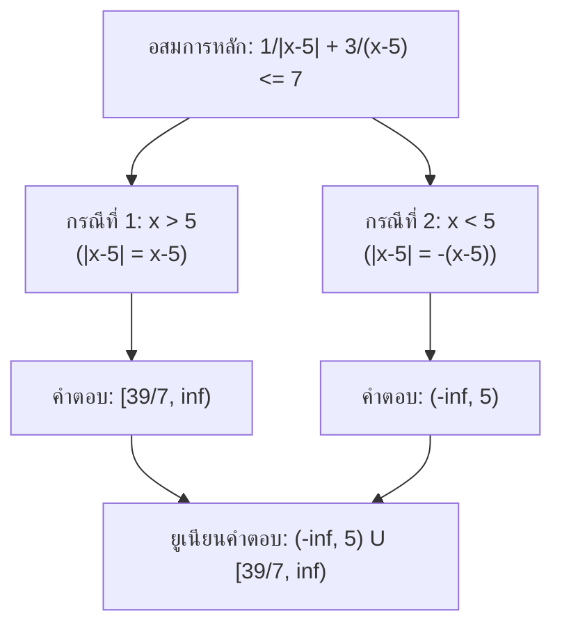

---
tags:
  - math
  - algebra
  - inequalities
  - absolute-value
date: 2026-08-22
aliases:
  - Absolute Value Inequality Solution
---

# การแก้เซตคำตอบของอสมการ $\frac{1}{|x-5|} + \frac{3}{x-5} \le 7$

> [!QUESTION] โจทย์
> ข้อใดคือเซตคำตอบของอสมการ $\frac{1}{|x-5|} + \frac{3}{x-5} \le 7$ โดยที่ $x \neq 5$
> - **ก.** $(-\infty, 5) \cup \left[\frac{39}{7}, \infty\right)$
> - **ข.** $(-\infty, 5) \cup \left[\frac{37}{7}, \infty\right)$
> - **ค.** $\left(-\infty, \frac{37}{7}\right] \cup \left[\frac{39}{7}, \infty\right)$
> - **ง.** $\left[\frac{37}{7}, \frac{39}{7}\right]$

---

## 📌 วิธีคิดและขั้นตอนการทำ

เนื่องจากมีพจน์ค่าสัมบูรณ์ $|x - 5|$ จึงต้องแบ่งการพิจารณาออกเป็น **2 กรณี** ตามนิยามของค่าสัมบูรณ์

---

### กรณีที่ 1: เมื่อ $x > 5$
เมื่อ $x > 5$ จะได้ว่า $x - 5 > 0$ ดังนั้น **$|x - 5| = x - 5$**

แทนค่าลงในอสมการ:
$$\frac{1}{x-5} + \frac{3}{x-5} \le 7$$
$$\frac{4}{x-5} \le 7$$

เนื่องจาก $x - 5 > 0$ สามารถนำ $(x - 5)$ คูณทั้งสองข้างได้โดยไม่ต้องกลับเครื่องหมาย:
$$4 \le 7(x - 5)$$
$$4 \le 7x - 35$$
$$39 \le 7x \implies x \ge \frac{39}{7}$$

นำไปอินเตอร์เซกต์กับเงื่อนไขกรณี ($x > 5$):
> เนื่องจาก $\frac{39}{7} \approx 5.57 > 5$
> $$\text{เซตคำตอบกรณีที่ 1} = \left[\frac{39}{7}, \infty\right)$$

---

### กรณีที่ 2: เมื่อ $x < 5$
เมื่อ $x < 5$ จะได้ว่า $x - 5 < 0$ ดังนั้น **$|x - 5| = -(x - 5)$**

แทนค่าลงในอสมการ:
$$\frac{1}{-(x-5)} + \frac{3}{x-5} \le 7$$
$$-\frac{1}{x-5} + \frac{3}{x-5} \le 7$$
$$\frac{2}{x-5} \le 7$$

> [!NOTE] ข้อสังเกต
> เนื่องจาก $x < 5$ ส่งผลให้ตัวส่วน $x - 5 < 0$ (เป็นค่าลบ) ในขณะที่ตัวเศษคือ $2$ (เป็นค่าบวก)
> ทำให้ค่าของพจน์ทางซ้ายมือเป็นจำนวนลบเสมอ ($\frac{2}{x-5} < 0$)
> ซึ่งจำนวนลบย่อม **$\le 7$ เป็นจริงเสมอ** สำหรับทุกค่า $x < 5$

ดังนั้น:
$$\text{เซตคำตอบกรณีที่ 2} = (-\infty, 5)$$

---

## 🎯 สรุปคำตอบ
นำคำตอบจากทั้งสองกรณีมารวมกัน (Union):
$$\text{เซตคำตอบทั้งหมด} = (-\infty, 5) \cup \left[\frac{39}{7}, \infty\right)$$

> [!TIP] ตอบ
> **ข้อ ก.** $(-\infty, 5) \cup \left[\frac{39}{7}, \infty\right)$
