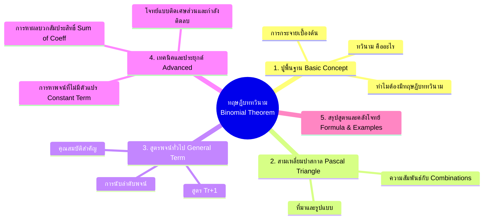

# 🚀 ทฤษฎีบททวินาม (Binomial Theorem): From Zero to Hero

ทฤษฎีบททวินามเป็นเครื่องมือสำคัญในวิชาพีชคณิตและการจัดหมู่ ช่วยให้เรากระจายพจน์ยกกำลังอย่าง $(a + b)^n$ ได้อย่างรวดเร็วโดยไม่ต้องนั่งคูณทีละวงเล็บ

---

## 🗺️ แผนผังภาพรวมเนื้อหา (Mindmap)



---

## 1. 🟢 พื้นฐานจากศูนย์ (Zero Level): ทวินามคืออะไร?

คำว่า **"ทวินาม" (Binomial)** หมายถึง นิพจน์พีชคณิตที่มี **2 พจน์บวกหรือลบกัน** เช่น $(a + b)$

เมื่อเรานำมาคูณซ้ำๆ หรือยกกำลัง:
- $(a + b)^1 = a + b$
- $(a + b)^2 = a^2 + 2ab + b^2$
- $(a + b)^3 = a^3 + 3a^2b + 3ab^2 + b^3$
- $(a + b)^4 = a^4 + 4a^3b + 6a^2b^2 + 4ab^3 + b^4$

### 🔍 สังเกตแบบรูป (Pattern):
1. **จำนวนพจน์ทั้งหมด:** การกระจาย $(a + b)^n$ จะได้ **$n + 1$ พจน์** เสมอ
2. **กำลังของ $a$:** เริ่มจาก $n$ แล้วลดลงทีละ 1 จนถึง $0$
3. **กำลังของ $b$:** เริ่มจาก $0$ แล้วเพิ่มขึ้นทีละ 1 จนถึง $n$
4. **ผลรวมกำลังในแต่ละพจน์:** ดีกรีรวมของ $a$ และ $b$ ในทุกพจน์จะเท่ากับ $n$ เสมอ

---

## 2. 🔺 สามเหลี่ยมปาสกาล (Pascal's Triangle)

สัมประสิทธิ์ด้านหน้าพจน์ต่างๆ เรียงตัวเป็นรูปสามเหลี่ยมปาสกาล:

```text
n = 0:               1
n = 1:             1   1
n = 2:           1   2   1
n = 3:         1   3   3   1
n = 4:       1   4   6   4   1
n = 5:     1   5  10  10   5   1
```

> **กฎการสร้าง:** ตัวเลขแต่ละตัวเกิดจาก "ผลบวกของตัวเลข 2 ตัวที่อยู่เหนือมันเยื้องซ้ายและขวา"

---

## 3. 🎯 หัวใจสำคัญ: ทฤษฎีบททวินามและสูตรพจน์ทั่วไป

เมื่อ $n$ มีค่ามากๆ (เช่น ยกกำลัง $10$ หรือ $20$) สามเหลี่ยมปาสกาลจะเขียนไม่ไหว จึงใช้ **การจัดหมู่ (Combination $\binom{n}{r}$)** เข้ามาช่วย

### 📜 สูตรการกระจายทวินาม (Binomial Theorem Formula)
$$(a + b)^n = \sum_{r=0}^{n} \binom{n}{r} a^{n-r} b^r$$
$$(a + b)^n = \binom{n}{0}a^n + \binom{n}{1}a^{n-1}b + \binom{n}{2}a^{n-2}b^2 + \dots + \binom{n}{n}b^n$$

โดยที่:
$$\binom{n}{r} = \frac{n!}{r!(n-r)!}$$

---

### ⭐ สูตรพระเอก: พจน์ทั่วไป $T_{r+1}$
$$T_{r+1} = \binom{n}{r} a^{n-r} b^r$$

> ⚠️ **ข้อควรระวังเรื่องลำดับพจน์:**
> - พจน์ที่ $1$ ($T_1$) $\rightarrow r = 0$
> - พจน์ที่ $2$ ($T_2$) $\rightarrow r = 1$
> - พจน์ที่ $k$ ($T_k$) $\rightarrow r = k - 1$
> - **ถ้าโจทย์ถามพจน์ที่ $8$ ให้ใช้ $r = 7$**

---

## 4. ⚡ เทคนิคและโจทย์ยอดฮิต (Hero Level)

### 🔹 รูปแบบที่ 1: การหาสัมประสิทธิ์ของพจน์ที่กำหนด
**ตัวอย่าง:** จงหาสัมประสิทธิ์ของ $x^3y^7$ จาก $(2x + y)^{10}$
1. วางสูตร $T_{r+1} = \binom{10}{r} (2x)^{10-r} (y)^r = \binom{10}{r} 2^{10-r} x^{10-r} y^r$
2. เทียบกำลังของ $y$: จะได้ $r = 7$
3. แทน $r = 7$:
   $$T_8 = \binom{10}{7} 2^3 x^3 y^7 = 120 \times 8 \times x^3y^7 = 960 x^3y^7$$
4. **ตอบ:** สัมประสิทธิ์คือ $960$

---

### 🔹 รูปแบบที่ 2: การหาพจน์ที่ไม่มีตัวแปร $x$ (Constant Term / Independent of $x$)
**ตัวอย่าง:** จงหาพจน์ที่ไม่มี $x$ จากการกระจาย $\left(x^2 + \frac{1}{x}\right)^9$
1. เขียนพจน์ทั่วไป:
   $$T_{r+1} = \binom{9}{r} (x^2)^{9-r} \left(\frac{1}{x}\right)^r = \binom{9}{r} x^{18-2r} x^{-r} = \binom{9}{r} x^{18-3r}$$
2. พจน์ที่ไม่มี $x$ หมายถึง $x^0 \implies 18 - 3r = 0 \implies r = 6$
3. นำ $r = 6$ ไปคำนวณค่า:
   $$T_7 = \binom{9}{6} x^0 = \binom{9}{3} = \frac{9 \times 8 \times 7}{3 \times 2 \times 1} = 84$$
4. **ตอบ:** พจน์ที่ไม่มีตัวแปรคือ $84$

---

### 🔹 รูปแบบที่ 3: การหาผลบวกของสัมประสิทธิ์ทุกพจน์ (Sum of Coefficients)
> 💡 **สูตรลัด:** แทนตัวแปรทุกตัวในโจทย์ด้วยเลข **$1$**

**ตัวอย่าง:** จงหาผลบวกสัมประสิทธิ์ทั้งหมดจากการกระจาย $(3x - 2y)^6$
- แทน $x = 1, y = 1$:
  $$\text{ผลบวกสัมประสิทธิ์} = (3(1) - 2(1))^6 = (3 - 2)^6 = 1^6 = \mathbf{1}$$

---

### 🔹 รูปแบบที่ 4: สมบัติของสัมประสิทธิ์ทวินาม (Binomial Identities)
จาก $(1 + x)^n = \binom{n}{0} + \binom{n}{1}x + \binom{n}{2}x^2 + \dots + \binom{n}{n}x^n$

1. **ผลรวมทุกตัว:** (แทน $x = 1$)
   $$\binom{n}{0} + \binom{n}{1} + \binom{n}{2} + \dots + \binom{n}{n} = 2^n$$
2. **ผลรวมสลับเครื่องหมาย:** (แทน $x = -1$)
   $$\binom{n}{0} - \binom{n}{1} + \binom{n}{2} - \dots + (-1)^n \binom{n}{n} = 0$$
3. **ผลรวมพจน์คู่ = ผลรวมพจน์คี่:**
   $$\binom{n}{0} + \binom{n}{2} + \binom{n}{4} + \dots = \binom{n}{1} + \binom{n}{3} + \binom{n}{5} + \dots = 2^{n-1}$$

---

## 📋 Checklist สรุปก่อนสอบ (Cheat Sheet)

| หัวข้อ | สูตร / ใจความสำคัญ |
| :--- | :--- |
| **จำนวนพจน์** | $(a+b)^n$ กระจายแล้วได้ **$n + 1$** พจน์ |
| **พจน์ทั่วไป** | $T_{r+1} = \binom{n}{r} a^{n-r} b^r$ |
| **ลำดับพจน์** | พจน์ที่ $k \implies r = k - 1$ |
| **พจน์กึ่งกลาง (Middle Term)** | - ถ้า $n$ เป็นเลขคู่: มี 1 พจน์ คือ พจน์ที่ $\frac{n}{2} + 1$<br/>- ถ้า $n$ เป็นเลขคี่: มี 2 พจน์ คือ พจน์ที่ $\frac{n+1}{2}$ และ $\frac{n+3}{2}$ |
| **ผลบวกสัมประสิทธิ์** | แทนตัวแปรทุกตัวด้วย $1$ |
| **ผลบวก $\binom{n}{r}$ ทั้งแถว** | $\sum_{r=0}^n \binom{n}{r} = 2^n$ |

---

## 🔗 โน้ตที่เกี่ยวข้องใน Vault
- [[เฉลยโจทย์ทฤษฎีบททวินาม_ข้อ7|เฉลยโจทย์ทฤษฎีบททวินาม ข้อ 7]]
