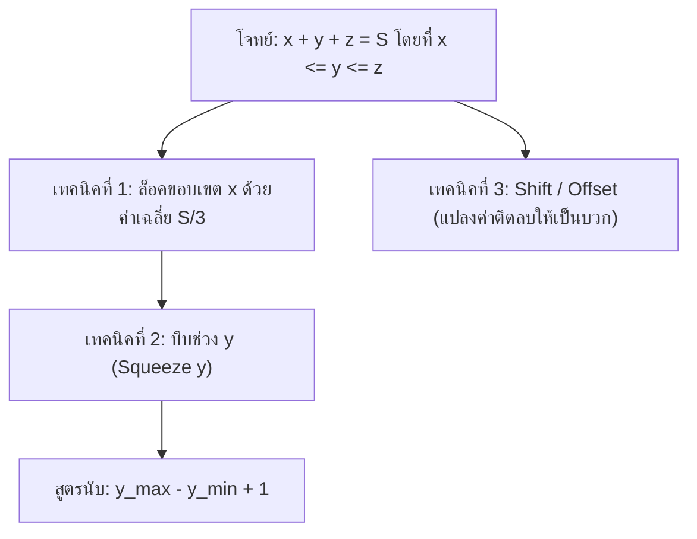

# เทคนิคการหาจำนวนคู่อันดับ $(x, y, z)$ ของจำนวนเต็ม (Ordered Tuples)

เมื่อเจอโจทย์กำหนดสมการผลบวกพร้อมเงื่อนไขเรียงลำดับ เช่น:
$$x + y + z = S \quad \text{โดยที่ } x \le y \le z$$

---

## ⚡ 4 เทคนิคหลักคิดลัด ไม่ต้องแจกแจงทีละตัว

---

### 1. ล็อคขอบเขตตัวแปรแรก ($x$) ด้วย "ค่าเฉลี่ย" (Bounding Trick)
เนื่องจาก $x \le y \le z$:
$$x + x + x \le x + y + z = S \implies 3x \le S \implies x \le \left\lfloor \frac{S}{3} \right\rfloor$$

> [!TIP] ประโยชน์
> ช่วยให้รู้ทันทีว่าต้องทดสอบค่า $x$ ถึงแค่ไหน ไม่ต้องสุ่มไล่เกินจำเป็น
> *ตัวอย่าง:* ถ้า $S = 10$ จะได้ $x \le \lfloor \frac{10}{3} \rfloor = 3$ เท่านั้น

---

### 2. บีบช่วงของ $y$ โดยตรง (Squeeze $y$ & Count)
เมื่อกำหนดค่า $x$ คงที่ จะได้สมการ 2 ตัวแปร:
$$y + z = S - x \quad \text{โดยที่ } x \le y \le z$$

เนื่องจาก $z = (S - x) - y$ และเงื่อนไข $y \le z$:
$$y \le (S - x) - y \implies 2y \le S - x \implies y \le \left\lfloor \frac{S - x}{2} \right\rfloor$$

ดังนั้น ขอบเขตของ $y$ คือ:
$$\max(x, y_{\min}) \le y \le \min\left( \left\lfloor \frac{S-x}{2} \right\rfloor, y_{\max} \right)$$

> [!IMPORTANT] สูตรคำนวณจำนวนชุดทันที
> เมื่อได้ขอบเขต $y_{\min} \le y \le y_{\max}$ แล้ว:
> $$\text{จำนวนชุดของ } (y, z) = y_{\max} - y_{\min} + 1$$

---

### 3. เทคนิคเลื่อนตัวแปร (Shift / Offset Trick)
หากขอบเขตเริ่มต้นติดลบ เช่น $-1 \le x \le y \le z$:
สามารถบวกค่าคงที่เพื่อปรับให้เริ่มต้นที่ $0$ หรือ $1$:
- ให้ $x' = x + 1, \; y' = y + 1, \; z' = z + 1$
- สมการจะกลายเป็น $x' + y' + z' = S + 3$
- เงื่อนไขกลายเป็น $0 \le x' \le y' \le z'$

---

### 4. ตัวอย่างการประยุกต์ใช้จริง

> [!EXAMPLE] ตัวอย่าง: หาจำนวน $(x, y, z)$ ทั้งหมดที่ $x+y+z=10$ และ $-1 \le x \le y \le z \le 10$

- ค่า $x \in \{-1, 0, 1, 2, 3\}$ เพราะ $x \le \lfloor \frac{10}{3} \rfloor = 3$

| ค่า $x$ | $y + z = 10 - x$ | ขอบเขตของ $y$ | จำนวนชุด ($y_{\max} - y_{\min} + 1$) |
| :---: | :---: | :--- | :---: |
| **$-1$** | $11$ | $1 \le y \le \lfloor \frac{11}{2} \rfloor = 5$ *(เพราะ $z \le 10 \implies y \ge 1$)* | $5 - 1 + 1 =$ **5** |
| **$0$** | $10$ | $0 \le y \le \lfloor \frac{10}{2} \rfloor = 5$ | $5 - 0 + 1 =$ **6** |
| **$1$** | $9$ | $1 \le y \le \lfloor \frac{9}{2} \rfloor = 4$ | $4 - 1 + 1 =$ **4** |
| **$2$** | $8$ | $2 \le y \le \lfloor \frac{8}{2} \rfloor = 4$ | $4 - 2 + 1 =$ **3** |
| **$3$** | $7$ | $3 \le y \le \lfloor \frac{7}{2} \rfloor = 3$ | $3 - 3 + 1 =$ **1** |

$$\text{รวมจำนวนชุดทั้งหมด} = 5 + 6 + 4 + 3 + 1 = 19 \text{ ชุด}$$

---

## 🔗 โน้ตที่เกี่ยวข้อง
- [[ข้อ 15เฉลยโจทย์ความสัมพันธ์และฟังก์ชัน_ข้อ9|เฉลยโจทย์จำนวนสมาชิกของเซต ข้อ 15]]
